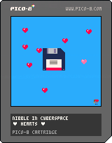

# nibble-0001

A Nibble NFT. Developed for NFT digital preservation testing



* Code: [hearts.p8](p8/hearts.p8)
* Image: [2022-11-27-nibble-pico8-nft_hearts.gif](nft/2022-11-27-nibble-pico8-nft_hearts.gif)

## Embedded XMP

Using the following commands.

### To write

```bash
exiftool -tagsfromfile nibble-hearts.xmp -xmp:all 
```

### To view

```
exiftool -G -a -xmp:all 2022-11-27-nibble-pico8-nft_hearts.gif | less
```

### XMP/XML

```xml
<?xml version="1.0"?>
<?xpacket begin='' id='W5M0MpCehiHzreSzNTczkc9d'?>
<x:xmpmeta xmlns:x="adobe:ns:meta/" x:xmptk="Image::ExifTool 12.40">
  <rdf:RDF xmlns:rdf="http://www.w3.org/1999/02/22-rdf-syntax-ns#">
    <rdf:Description xmlns:dc="http://purl.org/dc/elements/1.1/" rdf:about="">
      <dc:creator>
        <rdf:Seq>
          <rdf:li>Ross Spencer</rdf:li>
          <rdf:li>@beet_keeper</rdf:li>
        </rdf:Seq>
      </dc:creator>
      <dc:description>
        <rdf:Alt>
          <rdf:li>An image developed for NFT digital preservation testing by Ross Spencer aka @beet_keeper. It features a floppy disk rotating in a sky of hearts.</rdf:li>
        </rdf:Alt>
      </dc:description>
      <dc:rights>
        <rdf:Alt>
          <rdf:li>CC BY-SA</rdf:li>
        </rdf:Alt>
      </dc:rights>
      <dc:title>
        <rdf:Alt>
          <rdf:li>Nibble in Cyberspace: ❤ Hearts ❤</rdf:li>
        </rdf:Alt>
      </dc:title>
      <dc:format>
        <rdf:Alt>
          <rdf:li>image/gif</rdf:li>
          <rdf:li>Graphics Interchange Format 89a</rdf:li>
          <rdf:li>fmt/4</rdf:li>
        </rdf:Alt>
      </dc:format>
      <dc:date>
        <rdf:Alt>
          <rdf:li>2022-11-27</rdf:li>
        </rdf:Alt>
      </dc:date>
      <dc:identifier>
        <rdf:Alt>
          <rdf:li>0001</rdf:li>
        </rdf:Alt>
      </dc:identifier>
      <dc:subject>
        <rdf:Alt>
          <rdf:li>Digital Preservation</rdf:li>
          <rdf:li>digipres</rdf:li>
          <rdf:li>Web 3.0</rdf:li>
          <rdf:li>Cardano</rdf:li>
          <rdf:li>PICO-8</rdf:li>
        </rdf:Alt>
      </dc:subject>
      <dc:type>
        <rdf:Alt>
          <rdf:li>image</rdf:li>
        </rdf:Alt>
      </dc:type>
      <dc:source>
        <rdf:Alt>
          <rdf:li>https://github.com/ross-spencer/nibble-0001-hearts</rdf:li>
          <rdf:li>data:text/plain;base64,cGljby04IGNhcnRyaWRnZSAvLyBodHRwOi8vd3d3LnBpY28tOC5jb20KdmVyc2lvbiAzNApfX2x1YV9fCi0tbmliYmxlIGluIGN5YmVyc3BhY2UKLS3imaUgaGVhcnRzIOKZpQotLWJ5IHJvc3Mgc3BlbmNlcgoKZnVuY3Rpb24gX3VwZGF0ZSgpCiBfcm90YXRlKCkKZW5kCgotLT44Ci0tZGlzayByb3RhdGlvbiBoYW5kbGluZwpzbW92ZT0wCnNtb3ZldGljaz0xMgppZHg9MQpjaGFyPW5pbApmdW5jdGlvbiBfcm90YXRlKCkKCXNtb3ZlPV90aWNrKHNtb3ZlLHNtb3ZldGljaykKIGlmIGNoYXI9PW5pbCB0aGVuCiAgY2hhcj1mcm9udF8xCiBlbmQKIC0tZnJvbnQgYW5pbWF0aW9uCiBpZiBzbW92ZT09MCB0aGVuCiAgaWYgaWR4PT0xIHRoZW4KICAgY2hhcj1mcm9udF8xCiAgZW5kCiAgaWYgaWR4PT0yIHRoZW4KICAgY2hhcj1mcm9udF8xCiAgZW5kICAKICBpZiBpZHg9PTMgdGhlbgogICBjaGFyPWZyb250XzIKICBlbmQgIAogIGlmIGlkeD09NCB0aGVuCiAgIGNoYXI9ZnJvbnRfMwogIGVuZCAgCgkgLS1zaWRlIHByb2ZpbGUuLi4KICBpZiBpZHg9PTUgdGhlbgogICBjaGFyPXNpZGUKICBlbmQgIAogIC0tYmFjayBhbmltYXRpb24KICBpZiBpZHg9PTYgdGhlbgogICBjaGFyPWJhY2tfMQogIGVuZAogIGlmIGlkeD09NyB0aGVuCiAgIGNoYXI9YmFja18yCiAgZW5kICAKICBpZiBpZHg9PTggdGhlbgogICBjaGFyPWJhY2tfMwogIGVuZCAgICAKICBpZiBpZHg9PTkgdGhlbgogICBjaGFyPWJhY2tfMwogIGVuZAogIGlmIGlkeD09MTAgdGhlbgogICBjaGFyPWJhY2tfMwogIGVuZCAgCiAgLS1yb3RhdGUgaWR4CiAgaWYgaWR4ID09IDEwIHRoZW4KICAgaWR4PTEKICBlbHNlCiAgIGlkeD1pZHgrMQogIGVuZAogZW5kCgljbHMoMTIpCiAgX3N0YXJzKCkKIHNwcihjaGFyLnNwcl8sY2hhci5jb29yZF94LGNoYXIuY29vcmRfeSxjaGFyLnNwcl93LGNoYXIuc3ByX2gpCiAtLWRyYXcgbmliYmxlCiBzcHIoNDgsMTE4LDExOCwxLDEpCmVuZAoKLS0+OAotLWJhY2tncm91bmQgaW1hZ2UgaGFuZGxpbmcKbG1vdmU9MApsdGljaz0yNQpsdGFiPXsxNiwxNiwzMiwxNiwzMiwzMiwxNiwzMn0KbHBvc194PXsKIHJuZCgxMDUpKzEwLAogcm5kKDEwNSkrMTAsCiBybmQoMTA1KSsxMCwKIHJuZCgxMDUpKzEwLAogcm5kKDEwNSkrMTAsCiBybmQoMTA1KSsxMCwKIHJuZCgxMDUpKzEwLAogcm5kKDEwNSkrMTAsCn0KbHBvc195PXsKIHJuZCgxMDUpKzEwLAogcm5kKDEwNSkrMTAsCiBybmQoMTA1KSsxMCwKIHJuZCgxMDUpKzEwLAogcm5kKDEwNSkrMTAsCiBybmQoMTA1KSsxMCwKIHJuZCgxMDUpKzEwLAogcm5kKDEwNSkrMTAsCn0KZnVuY3Rpb24gX3N0YXJzKCkgIAoJbG1vdmU9X3RpY2sobG1vdmUsbHRpY2spCglpZiBsbW92ZT09MCB0aGVuCgkgZm9yIGk9MSw4LDEgZG8KCSAJbHRhYltpXT1ybmQoezE2LDMyfSkKCSBlbmQKCWVuZAogIHNwcihsdGFiWzFdLGxwb3NfeFsxXSxscG9zX3lbMV0sMSwxKQogIHNwcihsdGFiWzJdLGxwb3NfeFsyXSxscG9zX3lbMl0sMSwxKQogIHNwcihsdGFiWzNdLGxwb3NfeFszXSxscG9zX3lbM10sMSwxKQogIHNwcihsdGFiWzRdLGxwb3NfeFs0XSxscG9zX3lbNF0sMSwxKQogIHNwcihsdGFiWzVdLGxwb3NfeFs1XSxscG9zX3lbNV0sMSwxKQogIHNwcihsdGFiWzZdLGxwb3NfeFs2XSxscG9zX3lbNl0sMSwxKSAgICAgICAgICAgICAgIAogIHNwcihsdGFiWzddLGxwb3NfeFs3XSxscG9zX3lbN10sMSwxKQogIHNwcihsdGFiWzhdLGxwb3NfeFs4XSxscG9zX3lbOF0sMSwxKSAgICAgIAplbmQKLS0+OAotLXNwcml0ZSBsYXlvdXQgZGF0YQpmcm9udF8xPXsKIHNwcl89MSwKIHNwcl93PTQsCiBzcHJfaD00LAogY29vcmRfeD00NSwKIGNvb3JkX3k9NDUsCn0KCmZyb250XzI9ewogc3ByXz05LAogc3ByX3c9MiwKIHNwcl9oPTQsCiBjb29yZF94PTUyLAogY29vcmRfeT00NSwKfQoKZnJvbnRfMz17CiBzcHJfPTEzLAogc3ByX3c9MSwKIHNwcl9oPTQsCiBjb29yZF94PTU1LAogY29vcmRfeT00NSwKfQoKCnNpZGU9ewogc3ByXz0xNSwKIHNwcl93PTEsCiBzcHJfaD00LAogY29vcmRfeD01NSwKIGNvb3JkX3k9NDUsCn0KCmJhY2tfMT17CiBzcHJfPTE0LAogc3ByX3c9MSwKIHNwcl9oPTQsCiBjb29yZF94PTU1LAogY29vcmRfeT00NSwKfQoKYmFja18yPXsKIHNwcl89MTEsCiBzcHJfdz0yLAogc3ByX2g9NCwKIGNvb3JkX3g9NTIsCiBjb29yZF95PTQ1LAp9CgpiYWNrXzM9ewogc3ByXz01LAogc3ByX3c9NCwKIHNwcl9oPTQsCiBjb29yZF94PTQ1LAogY29vcmRfeT00NSwKfQoKLS0+OAotLXRpY2tlcgotLXRpY2tjb3VudCAzMCBpcyBvbmUgc2Vjb25kCi0tYXMgd2UgdXBkYXRlIDMwIHRpbWVzIHBlciAKLS1zZWNvbmQuCmZ1bmN0aW9uIF90aWNrKHRpY2ssbGltaXQpCiBpZiB0aWNrPT0wIHRoZW4KICB0aWNrPWxpbWl0CiAgcmV0dXJuIHRpY2sKIGVuZAogcmV0dXJuIHRpY2stMQplbmQKCl9fZ2Z4X18KMDAwMDAwMDAxMTExMTFkZDY2NjY2NjY2NjY2NjYxMTExMTAwMDAwMDAwMDAwMDExMTExNjY2NjY2NjY2NjY2NmRkMTExMTExMDExMWQ2NjY2NjExMDAwMDAwMDAxMTY2NjY2NmQxMTAwMWQ2NjAwMDAwMDY2ZDEwMDAwMDEwMDAKMDAwMDAwMDAxMTExMTFkZDY2NjY2NjY2ZGRkNjYxMTExMTEwMDAwMDAwMDAwMTExMTExNjZkZGQ2NjY2NjY2NmRkMTExMTExMDExMWQ2NmRkNjExMTAwMDAwMDExMTZkZDY2NmQxMTAwMWQ2ZDYwMDAwNmQ2ZDEwMDAwMTEwMDAKMDA3MDA3MDAxMTExMTFkZDY2NjY2NjY2ZGRkNjYxMTExMTExMDAwMDAwMDAxMTExMTExNjZkZGQ2NjY2NjY2NmRkMTExMTExMDExMWQ2NmRkNjExMTEwMDAwMTExMTZkZDY2NmQxMTAwMWQ2ZDYxMDAxNmQ2ZDEwMDAwMTEwMDAKMDAwNzcwMDAxMTExMTFkZDY2NjY2NjY2ZGRkNjYxMTExMTExMTAwMDAwMDExMTExMTExNjZkZGQ2NjY2NjY2NmRkMTExMTExMDExMWQ2NmRkNjExMTExMDAxMTExMTZkZDY2NmQxMTAwMWQ2ZDYxMDAxNmQ2ZDEwMDAwMTEwMDAKMDAwNzcwMDAxMTExMTFkZDY2NjY2NjY2ZGRkNjYxMTExMTExMTEwMDAwMTExMTExMTExNjZkZGQ2NjY2NjY2NmRkMTExMTExMDExMWQ2NmRkNjExMTExMDAxMTExMTZkZDY2NmQxMTAwMWQ2ZDYxMDAxNmQ2ZDEwMDAwMTEwMDAKMDA3MDA3MDAxMTExMTFkZDY2NjY2NjY2ZGRkNjYxMTExMTExMTExMDAxMTExMTExMTExNjZkZGQ2NjY2NjY2NmRkMTExMTExMDExMWQ2NmRkNjExMTExMDAxMTExMTZkZDY2NmQxMTAwMWQ2ZDYxMDAxNmQ2ZDEwMDAwMTEwMDAKMDAwMDAwMDAxMTExMTFkZDY2NjY2NjY2ZGRkNjYxMTExMTExMTExMTExMTExMTExMTExNjZkZGQ2NjY2NjY2NmRkMTExMTExMDExMWQ2NmRkNjExMTExMDAxMTExMTZkZDY2NmQxMTAwMWQ2ZDYxMDAxNmQ2ZDEwMDAwMTEwMDAKMDAwMDAwMDAxMTExMTFkZDY2NjY2NjY2NjY2NjYxMTExMTExMTExMTExMTExMTExMTExNjY2NjY2NjY2NjY2NmRkMTExMTExMDExMWQ2NjY2NjExMTExMDAxMTExMTY2NjY2NmQxMTAwMWQ2NjYxMDAxNjY2ZDEwMDAwMTEwMDAKMDg4MDA4ODAxMTExMTExMTExMTExMTExMTExMTExMTExMTExMTExMTExMTExMTExMTExMTExMTExMTExMTExMTExMTExMTExMDExMTExMTExMTExMTExMDAxMTExMTExMTExMTExMTAwMTExMTExMDAxMTExMTEwMDAwMTEwMDAKODg3ODg4ODgxMTExMTExMTExMTExMTExMTExMTExMTExMTExMTExMTExMTExMTExMTExMTExMTExMTExMTExMTExMTExMTExMDExMTExMTExMTExMTExMDAxMTExMTExMTExMTExMTAwMTExMTExMDAxMTExMTEwMDAwMTEwMDAKODg3ODg4ODgxMTExMTExMTExMTExMTExMTExMTExMTExMTExMTExMTExMTExMTExMTExMTExMTExMTExMTExMTExMTExMTExMDExMTExMTExMTExMTExMDAxMTExMTExMTExMTExMTAwMTExMTExMDAxMTExMTEwMDAwMTEwMDAKODg4ODg4ODgxMTExMTExMTExMTExMTExMTExMTExMTExMTExMTExMTExMTExMTExMTExMTExMTExMTExMTExMTExMTExMTExMDExMTExMTExMTExMTExMDAxMTExMTExMTExMTExMTAwMTExMTExMDAxMTExMTEwMDAwMTEwMDAKMDg4ODg4ODAxMTExMTExMTExMTExMTExMTExMTExMTExMTExMTExMTExMTExMTExMTExMTExMTExMTExMTExMTExMTExMTExMDExMTExMTExMTExMTExMDAxMTExMTExMTExMTExMTAwMTExMTExMDAxMTExMTEwMDAwMTEwMDAKMDA4ODg4MDAxMTExMTExMTExMTExMTExMTExMTExMTExMTExMTExMTExMTExMTExMTExMTExMTExMTExMTExMTExMTExMTExMDExMTExMTExMTExMTExMDAxMTExMTExMTExMTExMTAwMTExMTExMDAxMTExMTEwMDAwMTEwMDAKMDAwODgwMDAxMTExMTExMTExMTExMTExMTExMTExMTExMTExMTExMTExMTExMTExMTExMTExMTY2MTExMTExMTExMTExMTExMDExMTExMTExMTExMTExMDAxMTExMTExMTExMTExMTAwMTExMTExMDAxMTExMTEwMDAwMTEwMDAKMDAwMDAwMDAxMTExMTExMTExMTExMTExMTExMTExMTExMTExMTExMTExMTExMTExMTExMTExNjY2NjExMTExMTExMTExMTExMDExMTExMTExMTExMTExMDAxMTExMTE2NjExMTExMTAwMTExMTExMDAxMTY2MTEwMDAwMTEwMDAKMGVlMDBlZTAxMTExMTc3Nzc3Nzc3Nzc3Nzc3Nzc3Nzc3NzcxMTExMTExMTExMTExMTExMTExNjY2NjExMTExMTExMTExMTExMDExMTE3Nzc3NzExMTExMDAxMTExMTE2NjExMTExMTAwMTE3NzExMDAxMTY2MTEwMDAwMTEwMDAKZWU3ZWVlZWUxMTExMTc3Nzc3Nzc3Nzc3Nzc3Nzc3Nzc3NzcxMTExMTExMTExMTExMTExMTExMTY2MTExMTExMTExMTExMTExMDExMTE3Nzc3NzExMTExMDAxMTExMTExMTExMTExMTAwMTE3NzExMDAxMTExMTEwMDAwMTEwMDAKZWU3ZWVlZWUxMTExMTc3Nzc3NTU1NTU1NTU1NTU3Nzc3NzcxMTExMTExMTExMTExMTExMTExMTExMTExMTExMTExMTExMTExMDExMTE3NTU1NzExMTExMDAxMTExMTExMTExMTExMTAwMTE3NzExMDAxMTExMTEwMDAwMTEwMDAKZWVlZWVlZWUxMTExMTc3Nzc3Nzc3Nzc3Nzc3Nzc3Nzc3NzcxMTExMTExMTExMTExMTExMTExMTExMTExMTExMTExMTExMTExMDExMTE3Nzc3NzExMTExMDAxMTExMTExMTExMTExMTAwMTE3NzExMDAxMTExMTEwMDAwMTEwMDAKMGVlZWVlZTAxMTExMTc3Nzc3NTU1NTU1NTU1NTU3Nzc3NzcxMTExMTExMTExMTExMTExMTExMTExMTExMTExMTExMTExMTExMDExMTE3NTU1NzExMTExMDAxMTExMTExMTExMTExMTAwMTE3NzExMDAxMTExMTEwMDAwMTEwMDAKMDBlZWVlMDAxMTExMTc3Nzc3Nzc3Nzc3Nzc3Nzc3Nzc3NzcxMTExMTExMTExMTExMTExMTExMTExMTExMTExMTExMTExMTExMDExMTE3Nzc3NzExMTExMDAxMTExMTExMTExMTExMTAwMTE3NzExMDAxMTExMTEwMDAwMTEwMDAKMDAwZWUwMDAxMTExMTc3Nzc3NTU1NTU1NTU1NTU3Nzc3NzcxMTExMTExMTExMTExMTExMTExMTExMTExMTExMTExMTExMTExMDExMTE3NTU1NzExMTExMDAxMTExMTExMTExMTExMTAwMTE3NzExMDAxMTExMTEwMDAwMTEwMDAKMDAwMDAwMDAxMTExMTc3Nzc3Nzc3Nzc3Nzc3Nzc3Nzc3NzcxMTExMTExMTExMTExMTExMTExMTExMTExMTExMTExMTExMTExMDExMTE3Nzc3NzExMTExMDAxMTExMTExMTExMTExMTAwMTE3NzExMDAxMTExMTEwMDAwMTEwMDAKMGRkZGRkMDAxMTExMTc3Nzc3Nzc3Nzc3Nzc3Nzc3Nzc3NzcxMTExMTExMTExMTExMTExMTExMTExMTExMTExMTExMTExMTExMDExMTE3Nzc3NzExMTExMDAxMTExMTExMTExMTExMTAwMTE3NzExMDAxMTExMTEwMDAwMTEwMDAKNTQ4ODg4ODAxMTExMTc3Nzc3Nzc3Nzc3Nzc3Nzc3Nzc3NzcxMTExMTExMTExNzc3Nzc3Nzc3Nzc3Nzc3Nzc3Nzc3NzExMTExMDExMTE3Nzc3NzExMTExMDAxMTExMTc3Nzc3MTExMTAwMTE3NzExMDAxMTc3MTEwMDAwMTEwMDAKNTQ4ODg4ODAxMTExMTc3Nzc3Nzc3Nzc3Nzc3Nzc3Nzc3NzcxMTExMTExMTExNzc3Nzc3Nzc3Nzc3Nzc3Nzc3NzU1NzExMTExMDExMTE3Nzc3NzExMTExMDAxMTExMTc3Nzc3MTExMTAwMTE3NzExMDAxMTc3MTEwMDAwMTEwMDAKNWRkNDQ0ZDAxMTExMTc3Nzc3Nzc3Nzc3Nzc3Nzc3Nzc3NzcxMTExMTExMTExNzc3Nzc3Nzc3Nzc3Nzc3Nzc3Nzc3NzExMTExMDExMTE3Nzc3NzExMTExMDAxMTExMTc3Nzc3MTExMTAwMTE3NzExMDAxMTc3MTEwMDAwMTEwMDAKOWRkZGRkMDAxMTExMTg4ODg4ODg4ODg4ODg4ODg4ODg4ODgxMTExMTExMTExODg4ODg4ODg4ODg4ODg4ODg4ODg4ODExMTExMDExMTE4ODg4ODExMTExMDAxMTExMTg4ODg4MTExMTAwMTE4ODExMDAxMTc3MTEwMDAwMTEwMDAKOTBkMGQwMDAxMTExMTg4ODg4ODg4ODg4ODg4ODg4ODg4ODgxMTExMTExMTExODg4ODg4ODg4ODg4ODg4ODg4ODg4ODExMTExMDExMTE4ODg4ODExMTExMDAxMTExMTg4ODg4MTExMTAwMTE4ODExMDAxMTg4MTEwMDAwMTEwMDAKMDBkMGQwMDAxZGQxMTg4ODg4ODg4ODg4ODg4ODg4ODg4ODgxMWRkMTFkZDExODg4ODg4ODg4ODg4ODg4ODg4ODg4ODExZGQxMDFkMTE4ODg4ODExMWQxMDAxZDExMTg4ODg4MTFkMTAwMTE4ODExMDAxMTg4MTEwMDAwMTEwMDAKMDAxMDEwMDAxMTExMTg4ODg4ODg4ODg4ODg4ODg4ODg4ODgxMTExMTExMTExODg4ODg4ODg4ODg4ODg4ODg4ODg4ODExMTExMDExMTE4ODg4ODExMTExMDAxMTExMTg4ODg4MTExMTAwMTE4ODExMDAxMTg4MTEwMDAwMTEwMDAKX19sYWJlbF9fCmNjY2NjY2NjY2NjY2NjY2NjY2NjY2NjY2NjY2NjY2NjY2NjY2NjY2NjY2NjY2NjY2NjY2NjY2NjY2NjY2NjY2NjY2NjY2NjY2NjY2NjY2NjY2NjY2NjY2NjY2NjY2NjY2NjY2NjY2NjY2NjY2NjY2NjY2NjY2NjY2NjY2NjY2NjCmNjY2NjY2NjY2NjY2NjY2NjY2NjY2NjY2NjY2NjY2NjY2NjY2NjY2NjY2NjY2NjY2NjY2NjY2NjY2NjY2NjY2NjY2NjY2NjY2NjY2NjY2NjY2NjY2NjY2NjY2NjY2NjY2NjY2NjY2NjY2NjY2NjY2NjY2NjY2NjY2NjY2NjY2NjCmNjY2NjY2NjY2NjY2NjY2NjY2NjY2NjY2NjY2NjY2NjY2NjY2NjY2NjY2NjY2NjY2NjY2NjY2NjY2NjY2NjY2NjY2NjY2NjY2NjY2NjY2NjY2NjY2NjY2NjY2NjY2NjY2NjY2NjY2NjY2NjY2NjY2NjY2NjY2NjY2NjY2NjY2NjCmNjY2NjY2NjY2NjY2NjY2NjY2NjY2NjY2NjY2NjY2NjY2NjY2NjY2NjY2NjY2NjY2NjY2NjY2NjY2NjY2NjY2NjY2NjY2NjY2NjY2NjY2NjY2NjY2NjY2NjY2NjY2NjY2NjY2NjY2NjY2NjY2NjY2NjY2NjY2NjY2NjY2NjY2NjCmNjY2NjY2NjY2NjY2NjY2NjY2NjY2NjY2NjY2NjY2NjY2NjY2NjY2NjY2NjY2NjY2NjY2NjY2NjY2NjY2NjY2NjY2NjY2NjY2NjY2NjY2NjY2NjY2NjY2NjY2NjY2NjY2NjY2NjY2NjY2NjY2NjY2NjY2NjY2NjY2NjY2NjY2NjCmNjY2NjY2NjY2NjY2NjY2NjY2NjY2NjY2NjY2NjY2NjY2NjY2NjY2NjY2NjY2NjY2NjY2NjY2NjY2NjY2NjY2NjY2NjY2NjY2NjY2NjY2NjY2NjY2NjY2NjY2NjY2NjY2NjY2NjY2NjY2NjY2NjY2NjY2NjY2NjY2NjY2NjY2NjCmNjY2NjY2NjY2NjY2NjY2NjY2NjY2NjY2NjY2NjY2NjY2NjY2NjY2NjY2NjY2NjY2NjY2NjY2NjY2NjY2NjY2NjY2NjY2NjY2NjY2NjY2NjY2NjY2NjY2NjY2NjY2NjY2NjY2NjY2NjY2NjY2NjY2NjY2NjY2NjY2NjY2NjY2NjCmNjY2NjY2NjY2NjY2NjY2NjY2NjY2NjY2NjY2NjY2NjY2NjY2NjY2NjY2NjY2NjY2NjY2NjY2NjY2NjY2NjY2NjY2NjY2NjY2NjY2NjY2NjY2NjY2NjY2NjY2NjY2NjY2NjY2NjY2NjY2NjY2NjY2NjY2NjY2NjY2NjY2NjY2NjCmNjY2NjY2NjY2NjY2NjY2NjY2NjY2NjY2NjY2NjY2NjY2NjY2NjY2NjY2NjY2NjY2NjY2NjY2NjY2NjY2NjY2NjY2NjY2NjY2NjY2NjY2NjY2NjY2NjY2NjY2NjY2NjY2NjY2NjY2NjY2NjY2NjY2NjY2NjY2NjY2NjY2NjY2NjCmNjY2NjY2NjY2NjY2NjY2NjY2NjY2NjY2NjY2NjY2NjY2NjY2NjY2NjY2NjY2NjY2NjY2NjY2NjY2NjY2NjY2NjY2NjY2NjY2NjY2NjY2NjY2NjY2NjY2NjY2NjY2NjY2NjY2NjY2NjY2NjY2NjY2NjY2NjY2NjY2NjY2NjY2NjCmNjY2NjY2NjY2NjY2NjY2NjY2NjY2NjY2NjY2NjY2NjY2NjY2NjY2NjY2NjY2NjY2NjY2NjY2NjY2NjY2NjY2NjY2NjY2NjY2NjY2NjY2NjY2NjY2NjY2NjY2NjY2NjY2NjY2NjY2NjY2NjY2NjY2NjY2NjY2NjY2NjY2NjY2NjCmNjY2NjY2NjY2NjY2NjY2NjY2NjY2NjY2NjY2NjY2NjY2NjY2NjY2NjY2NjY2NjY2NjY2NjY2NjY2NjY2NjY2NjY2NjY2NjY2NjY2NjY2NjY2NjY2NjY2NjY2NjY2NjY2NjY2NjY2NjY2NjY2NjY2NjY2NjY2NjY2NjY2NjY2NjCmNjY2NjY2NjY2NjY2NjY2NjY2NjY2NjY2NjY2NjY2NjY2NjY2NjY2NjY2NjY2NjY2NjY2NjY2NjY2NjY2NjY2NjY2NjY2NjY2NjY2NjY2NjY2NjY2NjY2NjY2NjY2NjY2NjY2NjY2NjY2NjY2NjY2NjY2NjY2NjY2NjY2NjY2NjCmNjY2NjY2NjY2NjY2NjY2NjY2NjY2NjY2NjY2NjY2NjY2NjY2NjY2NjY2NjY2NjY2NjY2NjY2NjY2NjY2NjY2NjY2NjY2NjY2NjY2NjY2NjY2NjY2NjY2NjY2NjY2NjY2NjY2NjY2NjY2NjY2NjY2NjY2NjY2NjY2NjY2NjY2NjCmNjY2NjY2NjY2NjY2NjY2NjY2NjY2NjY2NjY2NjY2NjY2NjY2NjY2NjY2NjY2NjY2NjY2NjY2NjY2NjY2NjY2NjY2NjY2NjY2NjY2NjY2NjY2NjY2NjY2NjY2NjY2NjY2NjY2NjY2NjY2NjY2NjY2NjY2NjY2NjY2NjY2NjY2NjCmNjY2NjY2NjY2NjY2NjY2NjY2NjY2NjY2NjY2NjY2NjY2NjY2NjY2NjY2NjY2NjY2NjY2NjY2NjY2NjY2NjY2NjY2NjY2NjY2NjY2NjY2NjY2NjY2NjY2NjY2NjY2NjY2NjY2NjY2NjY2NjY2NjY2NjY2NjY2NjY2NjY2NjY2NjCmNjY2NjY2NjY2NjY2NjY2NjODhjYzg4Y2NjY2NjY2NjY2NjY2NjY2NjY2NjY2NjY2NjY2NjY2NjY2NjY2NjY2NjY2NjY2NjY2NjY2NjY2NjY2NjY2NjY2NjY2NjY2NjY2NjY2NjY2NjY2NjY2NjY2NjY2NjY2NjY2NjY2NjY2NjCmNjY2NjY2NjY2NjY2NjY2M4ODc4ODg4OGNjY2NjY2NjY2NjY2NjY2NjY2NjY2NjY2NjY2NjY2NjY2NjY2NjY2NjY2NjY2NjY2NjY2NjY2NjY2NjY2NjY2NjY2NjY2NjY2NjY2NjY2NjY2NjY2NjY2NjY2NjY2NjY2NjY2NjY2NjCmNjY2NjY2NjY2NjY2NjY2M4ODc4ODg4OGNjY2NjY2NjY2NjY2NjY2NjY2NjY2NjY2NjY2NjY2NjY2NjY2NjY2NjY2NjY2NjY2NjY2NjY2NjY2NjY2NjY2NjY2NjY2NjY2NjY2NjY2NjY2NjYzg4Y2M4OGNjY2NjY2NjY2NjY2NjCmNjY2NjY2NjY2NjY2NjY2M4ODg4ODg4OGNjY2NjY2NjY2NjY2NjY2NjY2NjY2NjY2NjY2NjY2NjY2NjY2NjY2NjY2NjY2NjY2NjY2NjY2NjY2NjY2NjY2NjY2NjY2NjY2NjY2NjY2NjY2NjODg3ODg4ODhjY2NjY2NjY2NjY2NjCmNjY2NjY2NjY2NjY2NjY2NjODg4ODg4Y2NjY2NjY2NjY2NjY2NjY2NjY2NjY2NjY2NjY2NjY2NjY2NjY2NjY2NjY2NjY2NjY2NjY2NjY2NjY2NjY2NjY2NjY2NjY2NjY2NjY2NjY2NjY2NjODg3ODg4ODhjY2NjY2NjY2NjY2NjCmNjY2NjY2NjY2NjY2NjY2NjYzg4ODhjY2NjY2NjY2NjY2NjY2NjY2NjY2NjY2NjY2NjY2NjY2NjY2NjY2NjY2NjY2NjY2NjY2NjY2NjY2NjY2NjY2NjY2NjY2NjY2NjY2NjY2NjY2NjY2NjODg4ODg4ODhjY2NjY2NjY2NjY2NjCmNjY2NjY2NjY2NjY2NjY2NjY2M4OGNjY2NjY2NjY2NjY2NjY2NjY2NjY2NjY2NjY2NjY2NjY2NjY2NjY2NjY2NjY2NjY2NjY2NjY2NjY2NjY2NjY2NjY2NjY2NjY2NjY2NjY2NjY2NjY2NjYzg4ODg4OGNjY2NjY2NjY2NjY2NjCmNjY2NjY2NjY2NjY2NjY2NjY2NjY2NjY2NjY2NjY2NjY2NjY2NjY2NjY2NjY2NjY2NjY2NjY2NjY2NjY2NjY2NjY2NjY2NjY2NjY2NjY2NjY2NjY2NjY2NjY2NjY2NjY2NjY2NjY2NjY2NjY2M4ODg4Y2NjY2NjY2NjY2NjY2NjCmNjY2NjY2NjY2NjY2NjY2NjY2NjY2NjY2NjY2NjY2NjY2NjY2NjY2NjY2NjY2NjY2NjY2NjY2NjY2NjY2NjY2NjY2NjY2NjY2NjY2NjY2NjY2NjY2NjY2NjY2NjY2NjY2NjY2NjY2NjY2NjY2NjODhjY2NjY2NjY2NjY2NjY2NjCmNjY2NjY2NjY2NjY2NjY2NjY2NjY2NjY2NjY2NjY2NjY2NjY2NjY2NjY2NjY2NjY2NjY2NjY2NjY2NjY2NjY2NjY2NjY2NjY2NjY2NjY2NjY2NjY2NjY2NjY2NjY2NjY2NjY2NjY2NjY2NjY2NjY2NjY2NjY2NjY2NjY2NjY2NjCmNjY2NjY2NjY2NjY2NjY2NjY2NjY2NjY2NjY2NjY2NjY2NjY2NjY2NjY2NjY2NjY2NjY2NjY2NjY2NjY2NjY2NjY2NjY2NjY2NjY2NjY2NjY2NjY2NjY2NjY2NjY2NjY2NjY2NjY2NjY2NjY2NjY2NjY2NjY2NjY2NjY2NjY2NjCmNjY2NjY2NjY2NjY2NjY2NjY2NjY2NjY2NjY2NjY2NjY2NjY2NjY2NjY2NjY2NjY2NjY2NjY2NjY2NjY2NjY2NjY2NjY2NjY2NjY2NjY2NjY2NjY2NjY2NjY2NjY2NjY2NjY2NjY2NjY2NjY2NjY2NjY2NjY2NjY2NjY2NjY2NjCmNjY2NjY2NjY2NjY2NjY2NjY2NjY2NjY2NjY2NjY2NjY2NjY2NjY2NjY2NjY2NjY2NjY2NjY2NjY2NjY2NjY2NjY2NjY2NjY2NjY2NjY2NjY2NjY2NjY2NjY2NjY2NjY2NjY2NjY2NjY2NjY2NjY2NjY2NjY2NjY2NjY2NjY2NjCmNjY2NjY2NjY2NjY2NjY2NjY2NjY2NjY2NjY2NjY2NjY2NjY2NjY2NjY2NjY2NjY2NjY2NjY2NjY2NjY2NjY2NjY2NjY2NjY2NjY2NjY2NjY2NjY2NjY2NjY2NjY2NjY2NjY2NjY2NjY2NjY2NjY2NjY2NjY2NjY2NjY2NjY2NjCmNjY2NjY2NjY2NjY2NjY2NjY2NjY2NjY2NjY2NjY2NjY2NjY2NjY2NjY2NjY2NjY2NjY2NjY2NjY2NjY2NjY2NjY2NjY2NjY2NjY2NjY2NjY2NjY2NjY2NjY2NjY2NjY2NjY2NjY2NjY2NjY2NjY2NjY2NjY2NjY2NjY2NjY2NjCmNjY2NjY2NjY2NjY2NjY2NjY2NjY2NjY2NjY2NjY2NjY2NjY2NjY2NjY2NjY2NjY2NjY2NjY2NjY2NjY2NjY2NjY2NjY2NjY2NjODhjYzg4Y2NjY2NjY2NjY2NjY2NjY2NjY2NjY2NjY2NjY2NjY2NjY2NjY2NjY2NjY2NjY2NjCmNjY2NjY2NjY2NjY2NjY2NjY2NjY2NjY2NjY2NjY2NjY2NjY2NjY2NjY2NjY2NjY2NjY2NjY2NjY2NjY2NjY2NjY2NjY2NjY2M4ODc4ODg4OGNjY2NjY2NjY2NjY2NjY2NjY2NjY2NjY2NjY2NjY2NjY2NjY2NjY2NjY2NjY2NjCmNjY2NjY2NjY2NjY2NjY2NjY2NjY2NjY2NjY2NjY2NjY2NjY2NjY2NjY2NjY2NjY2NjY2NjY2NjY2NjY2NjY2NjY2NjY2NjY2M4ODc4ODg4OGNjY2NjY2NjY2NjY2NjY2NjY2NjY2NjY2NjY2NjY2NjY2NjY2NjY2NjY2NjY2NjCmNjY2NjY2NjY2NjY2NjY2NjY2NjY2NjY2NjY2NjY2NjY2NjY2NjY2NjY2NjY2NjY2NjY2NjY2NjY2NjY2NjY2NjY2NjY2NjY2M4ODg4ODg4OGNjY2NjY2NjY2NjY2NjY2NjY2NjY2NjY2NjY2NjY2NjY2NjY2NjY2NjY2NjY2NjCmNjY2NjY2NjY2NjY2NjY2NjY2NjY2NjY2NjY2NjY2NjY2NjY2NjY2NjY2NjY2NjY2NjY2NjY2NjY2NjY2NjY2NjY2NjY2NjY2NjODg4ODg4Y2NjY2NjY2NjY2NjY2NjY2NjY2NjY2NjY2NjY2NjY2NjY2NjY2NjY2NjY2NjY2NjCmNjY2NjY2NjY2NjY2NjY2NjY2NjY2NjY2NjY2NjY2NjY2NjY2NjY2NjY2NjY2NjY2NjY2NjY2NjY2NjY2NjY2NjY2NjY2NjY2NjYzg4ODhjY2NjY2NjY2NjY2NjY2NjY2NjY2NjY2NjY2NjY2NjY2NjY2NjY2NjY2NjY2NjY2NjCmNjY2NjY2NjY2NjY2NjY2NjY2NjY2NjY2NjY2NjY2NjY2NjY2NjY2NjY2NjY2NjY2NjY2NjY2NjY2NjY2NjY2NjY2NjY2NjY2NjY2M4OGNjY2NjY2NjY2NjY2NjY2NjY2NjY2NjY2NjY2NjY2NjY2NjY2NjY2NjY2NjY2NjY2NjCmNjY2NjY2NjY2NjY2NjY2NjY2NjY2NjY2NjY2NjY2NjY2NjY2NjY2NjY2NjY2NjY2NjY2NjY2NjY2NjY2NjY2NjY2NjY2NjY2NjY2NjY2NjY2NjY2NjY2NjY2NjY2NjY2NjY2NjY2NjY2NjY2NjY2NjY2NjY2NjY2NjY2NjY2NjCmNjY2NjY2NjY2NjY2NjY2NjY2NjY2NjY2NjY2NjY2NjY2NjY2NjY2NjY2NjY2NjY2NjY2NjY2NjY2NjY2NjY2NjY2NjY2NjY2NjY2NjY2NjY2NjY2NjY2NjY2NjY2NjY2NjY2NjY2NjY2NjY2NjY2NjY2NjY2NjY2NjY2NjY2NjCmNjY2NjY2NjY2NjY2NjY2NjODhjYzg4Y2NjY2NjY2NjY2NjY2NjY2NjY2NjY2NjY2NjY2NjY2NjY2NjY2NjY2NjY2NjY2NjY2NjY2NjY2NjY2NjY2NjY2NjY2NjY2NjY2NjY2NjY2NjY2NjY2NjY2NjY2NjY2NjY2NjY2NjY2NjCmNjY2NjY2NjY2NjY2NjY2M4ODc4ODg4OGNjY2NjY2NjY2NjY2NjY2NjY2NjY2NjY2NjY2NjY2NjY2NjY2NjY2NjY2NjY2NjY2NjY2NjY2NjY2NjY2NjY2NjY2NjY2NjY2NjY2NjY2NjY2NjY2NjY2NjY2NjY2NjY2NjY2NjY2NjCmNjY2NjY2NjY2NjY2NjY2M4ODc4ODg4OGNjY2NjY2NjY2NjY2NjY2NjY2NjY2NjY2NjY2NjY2NjY2NjY2NjY2NjY2NjY2NjY2NjY2NjY2NjY2NjY2NjY2NjY2NjY2NjY2NjY2NjY2NjY2NjY2NjY2NjY2NjY2NjY2NjY2NjY2NjCmNjY2NjY2NjY2NjY2NjY2M4ODg4ODg4OGNjY2NjY2NjY2NjY2NjY2NjY2NjY2NjY2NjY2NjY2NjY2NjY2NjY2NjY2NjY2NjY2NjY2NjY2NjY2NjY2NjY2NjY2NjY2NjY2NjY2NjY2NjY2NjY2NjY2NjY2NjY2NjY2NjY2NjY2NjCmNjY2NjY2NjY2NjY2NjY2NjODg4ODg4Y2NjY2NjY2NjY2NjY2NjY2NjY2NjY2NjY2NjY2NjY2NjY2NjY2NjY2NjY2NjY2NjY2NjY2NjY2NjY2NjY2NjY2NjY2NjY2NjY2NjY2NjY2NjY2NjY2NjY2NjY2NjY2NjY2NjY2NjY2NjCmNjY2NjY2NjY2NjY2NjY2NjYzg4ODhjY2NjY2NjY2NjY2NjY2M4OGNjODhjYzExMTExMWRkNjY2NjY2NjY2NjY2NjExMTExY2NjY2NjY2NjY2NjY2NjY2NjY2NjY2NjY2NjY2NjY2NjY2NjY2NjY2NjY2NjY2NjY2NjY2NjY2NjCmNjY2NjY2NjY2NjY2NjY2NjY2M4OGNjY2NjY2NjY2NjY2NjYzg4Nzg4ODg4YzExMTExMWRkNjY2NjY2NjZkZGQ2NjExMTExMWNjY2NjY2NjY2NjY2NjY2NjY2NjY2NjY2NjY2NjY2NjY2NjY2NjY2NjY2NjY2NjY2NjY2NjY2NjCmNjY2NjY2NjY2NjY2NjY2NjY2NjY2NjY2NjY2NjY2NjY2NjYzg4Nzg4ODg4YzExMTExMWRkNjY2NjY2NjZkZGQ2NjExMTExMTFjY2NjY2NjY2NjY2NjY2NjY2NjY2NjY2NjY2NjY2NjY2NjY2NjY2NjY2NjY2NjY2NjY2NjY2NjCmNjY2NjY2NjY2NjY2NjY2NjY2NjY2NjY2NjY2NjY2NjY2NjYzg4ODg4ODg4YzExMTExMWRkNjY2NjY2NjZkZGQ2NjExMTExMTExY2NjY2NjY2NjY2NjY2NjY2NjY2NjY2NjY2NjY2NjY2NjY2NjY2NjY2NjY2NjY2NjY2NjY2NjCmNjY2NjY2NjY2NjY2NjY2NjY2NjY2NjY2NjY2NjY2NjY2NjY2M4ODg4ODhjYzExMTExMWRkNjY2NjY2NjZkZGQ2NjExMTExMTExMWNjY2NjY2NjY2NjY2NjY2NjY2NjY2NjY2NjY2NjY2NjY2NjY2NjY2NjY2NjY2NjY2NjY2NjCmNjY2NjY2NjY2NjY2NjY2NjY2NjY2NjY2NjY2NjY2NjY2NjY2NjODg4OGNjYzExMTExMWRkNjY2NjY2NjZkZGQ2NjExMTExMTExMTFjY2NjY2NjY2NjY2NjY2NjY2NjY2NjY2NjY2NjY2NjY2NjY2NjY2NjY2NjY2NjY2NjY2NjCmNjY2NjY2NjY2NjY2NjY2NjY2NjY2NjY2NjY2NjY2NjY2NjY2NjYzg4Y2NjYzExMTExMWRkNjY2NjY2NjZkZGQ2NjExMTExMTExMTExY2NjY2NjY2NjY2NjY2NjY2NjY2NjY2NjY2NjY2NjY2NjY2NjY2NjY2NjY2NjY2NjY2NjCmNjY2NjY2NjY2NjY2NjY2NjY2NjY2NjY2NjY2NjY2NjY2NjY2NjY2NjY2NjYzExMTExMWRkNjY2NjY2NjY2NjY2NjExMTExMTExMTExY2NjY2NjY2NjY2NjY2NjY2NjY2NjY2NjY2NjY2NjY2NjY2NjY2NjY2NjY2NjY2NjY2NjCmNjY2NjY2NjY2NjY2NjY2NjY2NjY2NjY2NjY2NjY2NjY2NjY2NjY2NjY2NjYzExMTExMTExMTExMTExMTExMTExMTExMTExMTExMTExY2NjY2NjY2NjY2NjY2NjY2NjY2NjY2NjY2NjY2NjY2NjY2NjY2NjY2NjY2NjY2NjY2NjCmNjY2NjY2NjY2NjY2NjY2NjY2NjY2NjY2NjY2NjY2NjY2NjY2NjY2NjY2NjYzExMTExMTExMTExMTExMTExMTExMTExMTExMTExMTExY2NjY2NjY2NjY2NjY2NjY2NjY2NjY2NjY2NjY2NjY2NjY2NjY2NjY2NjY2NjY2NjY2NjCmNjY2NjY2NjY2NjY2NjY2NjY2NjY2NjY2NjY2NjY2NjY2NjY2NjY2NjY2NjYzExMTExMTExMTExMTExMTExMTExMTExMTExMTExMTExY2NjY2NjY2NjY2NjY2NjY2NjY2NjY2NjY2NjY2NjY2NjY2NjY2NjY2NjY2NjY2NjY2NjCmNjY2NjY2NjY2NjY2NjY2NjY2NjY2NjY2NjY2NjY2NjY2NjY2NjY2NjY2NjYzExMTExMTExMTExMTExMTExMTExMTExMTExMTExMTExY2NjY2NjY2NjY2NjY2NjY2NjY2NjY2NjY2NjY2NjY2NjY2NjY2NjY2NjY2NjY2NjY2NjCmNjY2NjY2NjY2NjY2NjY2NjY2NjY2NjY2NjY2NjY2NjY2NjY2NjY2NjY2NjYzExMTExMTExMTExMTExMTExMTExMTExMTExMTExMTExY2NjY2NjY2NjY2NjY2NjY2NjY2NjY2NjY2NjY2NjY2NjY2NjY2NjY2NjY2NjY2NjY2NjCmNjY2NjY2NjY2NjY2NjY2NjY2NjY2NjY2NjY2NjY2NjY2NjY2NjY2NjY2NjYzExMTExMTExMTExMTExMTExMTExMTExMTExMTExMTExY2NjY2NjY2NjY2NjY2NjY2NjY2NjY2NjY2NjY2NjY2NjY2NjY2NjY2NjY2NjY2NjY2NjCmNjY2NjY2NjY2NjY2NjY2NjY2NjY2NjY2NjY2NjY2NjY2NjY2NjY2NjY2NjYzExMTExMTExMTExMTExMTExMTExMTExMTExMTExMTExY2NjY2NjY2NjY2NjY2NjY2NjY2NjY2NjY2NjY2NjY2NjY2NjY2NjY2NjY2NjY2NjY2NjCmNjY2NjY2NjY2NjY2NjY2NjY2NjY2NjY2NjY2NjY2NjY2NjY2NjY2NjY2NjYzExMTExMTExMTExMTExMTExMTExMTExMTExMTExMTExY2NjY2NjY2NjY2NjY2NjY2NjY2NjY2NjY2NjY2NjY2NjY2NjY2NjY2NjY2NjY2NjY2NjCmNjY2NjY2NjY2NjY2NjY2NjY2NjY2NjY2NjY2NjY2NjY2NjY2NjY2NjY2NjYzExMTExNzc3Nzc3Nzc3Nzc3Nzc3Nzc3Nzc3NzExMTExY2NjY2NjY2NjY2NjY2NjY2NjY2NjY2NjZWVjY2VlY2NjY2NjY2NjY2NjY2NjY2NjY2NjCmNjY2NjY2NjY2NjY2NjY2NjY2NjY2NjY2NjY2NjY2NjY2NjY2NjY2NjY2NjYzExMTExNzc3Nzc3Nzc3Nzc3Nzc3Nzc3Nzc3NzExMTExY2NjY2NjY2NjY2NjY2NjY2NjY2NjY2NlZTdlZWVlZWNjY2NjY2NjY2NjY2NjY2NjY2NjCmNjY2NjY2NjY2NjY2NjY2NjY2NjY2NjY2NjY2NjY2NjY2NjY2NjY2NjY2NjYzExMTExNzc3Nzc1NTU1NTU1NTU1NTc3Nzc3NzExMTExY2NjY2NjY2NjY2NjY2NjY2NjY2NjY2NlZTdlZWVlZWNjY2NjY2NjY2NjY2NjY2NjY2NjCmNjY2NjY2NjY2NjY2NjY2NjY2NjY2NjY2NjY2NjY2NjY2NjY2NjY2NjY2NjYzExMTExNzc3Nzc3Nzc3Nzc3Nzc3Nzc3Nzc3NzExMTExY2NjY2NjY2NjY2NjY2NjY2NjY2NjY2NlZWVlZWVlZWNjY2NjY2NjY2NjY2NjY2NjY2NjCmNjY2NjY2NjY2NjY2NjY2NjY2NjY2NjY2NjY2NjY2NjY2NjY2NjY2NjY2NjYzExMTExNzc3Nzc1NTU1NTU1NTU1NTc3Nzc3NzExMTExY2NjY2NjY2NjY2NjY2NjY2NjY2NjY2NjZWVlZWVlY2NjY2NjY2NjY2NjY2NjY2NjY2NjCmNjY2NjY2NjY2NjY2NjY2NjY2NjY2NjODhjYzg4Y2NjY2NjY2NjY2NjY2NjYzExMTExNzc3Nzc3Nzc3Nzc3Nzc3Nzc3Nzc3NzExMTExY2NjY2NjY2NjY2NjY2NjY2NjY2NjY2NjY2VlZWVjY2NjY2NjY2NjY2NjY2NjY2NjY2NjCmNjY2NjY2NjY2NjY2NjY2NjY2NjY2M4ODc4ODg4OGNjY2NjY2NjY2NjY2NjYzExMTExNzc3Nzc1NTU1NTU1NTU1NTc3Nzc3NzExMTExY2NjY2NjY2NjY2NjY2NjY2NjY2NjY2NjY2NlZWNjY2NjY2NjY2NjY2NjY2NjY2NjY2NjCmNjY2NjY2NjY2NjY2NjY2NjY2NjY2M4ODc4ODg4OGNjY2NjY2NjY2NjY2NjYzExMTExNzc3Nzc3Nzc3Nzc3Nzc3Nzc3Nzc3NzExMTExY2NjY2NjY2NjY2NjY2NjY2NjY2NjY2NjY2NjY2NjY2NjY2NjY2NjY2NjY2NjY2NjY2NjCmNjY2NjY2NjY2NjY2NjY2NjY2NjY2M4ODg4ODg4OGNjY2NjY2NjY2NjY2NjYzExMTExNzc3Nzc3Nzc3Nzc3Nzc3Nzc3Nzc3NzExMTExY2NjY2NjY2NjY2NjY2NjY2NjY2NjY2NjY2NjY2NjY2NjY2NjY2NjY2NjY2NjY2NjY2NjCmNjY2NjY2NjY2NjY2NjY2NjY2NjY2NjODg4ODg4Y2NjY2NjY2NjY2NjY2NjYzExMTExNzc3Nzc3Nzc3Nzc3Nzc3Nzc3Nzc3NzExMTExY2NjY2NjY2NjY2NjY2NjY2NjY2NjY2NjY2NjY2NjY2NjY2NjY2NjY2NjY2NjY2NjY2NjCmNjY2NjY2NjY2NjY2NjY2NjY2NjY2NjYzg4ODhjY2NjY2NjY2NjY2NjY2NjYzExMTExNzc3Nzc3Nzc3Nzc3Nzc3Nzc3Nzc3NzExMTExY2NjY2NjY2NjY2NjY2NjY2NjY2NjY2NjY2NjY2NjY2NjY2NjY2NjY2NjY2NjY2NjY2NjCmNjY2NjY2NjY2NjY2NjY2NjY2NjY2NjY2M4OGNjY2NjY2NjY2NjY2NjY2NjYzExMTExNzc3Nzc3Nzc3Nzc3Nzc3Nzc3Nzc3NzExMTExY2NjY2NjY2NjY2NjY2NjY2NjY2NjY2NjY2NjY2NjY2NjY2NjY2NjY2NjY2NjY2NjY2NjCmNjY2NjY2NjY2NjY2NjY2NjY2NjY2NjY2NjY2NjY2NjY2NjY2NjY2NjY2NjYzExMTExODg4ODg4ODg4ODg4ODg4ODg4ODg4ODExMTExY2NjY2NjY2NjY2NjY2NjY2NjY2NjY2NjY2NjY2NjY2NjY2NjY2NjY2NjY2NjY2NjY2NjCmNjY2NjY2NjY2NjY2NjY2NjY2NjY2NjY2NjY2NjY2NjY2NjY2NjY2NjY2NjYzExMTExODg4ODg4ODg4ODg4ODg4ODg4ODg4ODExMTExY2NjY2NjY2NjY2NjY2NjY2NjY2NjY2NjY2NjY2NjY2NjY2NjY2NjY2NjY2NjY2NjY2NjCmNjY2NjY2NjY2NjY2NjY2NjY2NjY2NjY2NjY2NjY2NjY2NjY2NjY2NjY2NjYzFkZDExODg4ODg4ODg4ODg4ODg4ODg4ODg4ODExZGQxY2NjY2NjY2NjY2NjY2NjY2NjY2NjY2NjY2NjY2NjY2NjY2NjY2NjY2NjY2NjY2NjY2NjCmNjY2NjY2NjY2NjY2NjY2NjY2NjY2NjY2NjY2NjY2NjY2NjY2NjY2NjY2NjYzExMTExODg4ODg4ODg4ODg4ODg4ODg4ODg4ODExMTExY2NjY2NjY2NjY2NjY2NjY2NjY2NjY2NjY2NjY2NjY2NjY2NjY2NjY2NjY2NjY2NjY2NjCmNjY2NjY2NjY2NjY2NjY2NjY2NjY2NjY2NjY2NjY2NjY2NjY2NjY2NjY2NjY2NjY2NjY2NjY2NjY2NjY2NjY2NjY2NjY2NjY2NjY2NjY2NjY2NjY2NjY2NjY2NjY2NjY2NjY2NjY2NjY2NjY2NjY2NjY2NjY2NjY2NjY2NjY2NjCmNjY2NjY2NjY2NjY2NjY2NjY2NjY2NjY2NjY2NjY2NjY2NjY2NjY2NjY2NjY2NjY2NjY2NjY2NjY2NjY2NjY2NjY2NjY2NjY2NjY2NjY2NjY2NjY2NjY2NjY2NjY2NjY2NjY2NjY2NjY2NjY2NjY2NjY2NjY2NjY2NjY2NjY2NjCmNjY2NjY2NjY2NjY2NjY2NjY2NjY2NjY2NjY2NjY2NjY2NjY2NjY2NjY2NjY2NjY2NjY2NjY2NjY2NjY2NjY2NjY2NjY2NjY2NjY2NjY2NjY2NjY2NjY2NjY2NjY2NjY2NjY2NjY2NjY2NjY2NjY2NjY2NjY2NjY2NjY2NjY2NjCmNjY2NjY2NjY2NjY2NjY2NjY2NjY2NjY2NjY2NjY2NjY2NjY2NjY2NjY2NjY2NjY2NjY2NjY2NjY2NjY2NjY2NjY2NjY2NjY2NjY2NjY2NjY2NjY2NjY2NjY2NjY2NjY2NjY2NjY2NjY2NjY2NjY2NjY2NjY2NjY2NjY2NjY2NjCmNjY2NjY2NjY2NjY2NjY2NjY2NjY2NjY2NjY2NjY2NjY2NjY2NjY2NjY2NjY2NjY2NjY2NjY2NjY2NjY2NjY2NjY2NjY2NjY2NjY2NjY2NjY2NjY2NjY2NjY2NjY2NjY2NjY2NjY2NjY2NjY2NjY2NjY2NjY2NjY2NjY2NjY2NjCmNjY2NjY2NjY2NjY2NjY2NjY2NjY2NjY2NjY2NjY2NjY2NjY2NjY2NjY2NjY2NjY2NjY2NjY2NjY2NjY2NjY2NjY2NjY2NjY2NjY2NjY2NjY2NjY2NjY2NjY2NjY2NjY2NjY2NjY2NjY2NjY2NjY2NjY2NjY2NjY2NjY2NjY2NjCmNjY2NjY2NjY2NjY2NjY2NjY2NjY2NjY2NjY2NjY2NjY2NjY2NjY2NjY2NjY2NjY2NjY2NjY2NjY2NjY2NjY2NjY2NjY2NjY2NjY2NjY2NjY2NjY2NjY2NjY2NjY2NjY2NjY2NjY2NjY2NjY2NjY2NjY2NjY2NjY2NjY2NjY2NjCmNjY2NjY2NjY2NjY2NjY2NjY2NjY2NjY2NjY2NjY2NjY2NjY2NjY2NjY2NjY2NjY2NjY2NjY2NjY2NjY2NjY2NjY2NjY2NjY2NjY2NjY2NjY2NjY2NjY2NjY2NjY2NjY2NjY2NjY2NjY2NjY2NjY2NjY2NjY2NjY2NjY2NjY2NjCmNjY2NjY2NjY2NjY2NjY2NjY2NjY2NjY2NjY2NjY2NjY2NjY2NjY2NjY2NjY2NjY2NjY2NjY2NjY2NjY2NjY2NjY2NjY2NjY2NjY2NjY2NjY2NjY2NjY2NjY2NjY2NjY2NjY2NjY2NjY2NjY2NjY2NjY2NjY2NjY2NjY2NjY2NjCmNjY2NjY2NjY2NjY2NjY2NjY2NjY2NjY2NjY2NjY2NjY2NjY2NjY2NjY2NjY2NjY2NjY2NjY2NjY2NjY2NjY2NjY2NjY2NjY2NjY2NjY2NjY2NjY2NjY2NjY2NjY2NjY2NjY2NjY2NjY2NjY2NjY2NjY2NjY2NjY2NjY2NjY2NjCmNjY2NjY2NjY2NjY2NjY2NjY2NjY2NjY2NjY2NjY2NjY2NjY2NjY2NjY2NjY2NjY2NjY2NjY2NjY2NjY2NjY2NjY2NjY2NjY2NjY2NjY2NjY2NjY2NjY2NjY2NjY2NjY2NjY2NjY2NjY2NjY2NjY2NjY2NjY2NjY2NjY2NjY2NjCmNjY2NjY2NjY2NjY2NjY2NjY2NjY2NjY2NjY2NjY2NjY2NjY2NjY2NjY2NjY2NjY2NjY2NjY2NjY2NjY2NjY2NjY2NjY2NjY2NjY2NjY2NjY2NjY2NjY2NjY2NjY2NjY2NjY2NjY2NjY2NjY2NjY2NjY2NjY2NjY2NjY2NjY2NjCmNjY2NjY2NjY2NjY2NjY2NjY2NjY2NjY2NjY2NjY2NjY2NjY2NjY2NjY2NjY2NjY2NjY2NjY2NjY2NjY2NjY2NjY2NjY2NjY2NjY2NjY2NjY2NjY2NjY2NjY2NjY2NjY2NjY2NjY2NjY2NjY2NjY2NjY2NjY2NjY2NjY2NjY2NjCmNjY2NjY2NjY2NjY2NjY2NjY2NjY2NjY2NjY2NjY2NjY2NjY2NjY2NjY2NjY2NjY2NjY2NjY2NjY2NjY2NjY2NjY2NjY2NjY2NjY2NjY2NjY2NjY2NjY2NjY2NjY2NjY2NjY2NjY2NjY2NjY2NjY2NjY2NjY2NjY2NjY2NjY2NjCmNjY2NjY2NjY2NjY2NjY2NjY2NjY2NjY2NjY2NjY2NjY2NjY2NjY2NjY2NjY2NjY2NjY2NjY2NjY2NjY2NjY2NjY2NjY2NjY2NjY2NjY2NjY2NjY2NjY2NjY2NjY2NjY2NjY2NjY2NjY2NjY2NjY2NjY2NjY2NjY2NjY2NjY2NjCmNjY2NjY2NjY2NjY2NjY2NjY2NjY2NjY2NjY2NjY2NjY2NjY2NjY2NjY2NjY2NjY2NjY2NjY2NjY2NjY2NjY2NjY2NjY2NjY2NjY2NjY2NjY2NjY2NjY2NjY2NjY2NjY2NjY2NjY2NjY2NjY2NjY2NjY2NjY2NjY2NjY2NjY2NjCmNjY2NjY2NjY2NjY2NjY2NjY2NjY2NjY2NjY2NjY2NjY2NjY2NjY2NjY2NjY2NjY2NjY2NjY2NjY2NjY2NjY2NjY2NjY2NjY2NjY2NjY2NjY2NjY2NjY2NjY2NjY2NjY2NjY2NjY2NjY2NjY2NjY2NjY2NjY2NjY2NjY2NjY2NjCmNjY2NjY2NjY2NjY2NjY2NjY2NjY2NjY2NjY2NjY2NjY2NjY2NjY2NjY2NjY2NjY2NjY2NjY2NjY2NjY2NjY2NjY2NjY2NjY2NjY2NjY2NjY2NjY2NjY2NjY2NjY2NjY2NjY2NjY2NjY2NjY2NjY2NjY2NjY2NjY2NjY2NjY2NjCmNjY2NjY2NjY2NjY2NjY2NjY2NjY2NjY2NjY2NjY2NjY2NjY2NjY2NjY2NjY2NjY2NjY2NjY2NjY2NjY2NjY2NjY2NjY2NjY2NjY2NjY2NjY2NjY2NjY2NjY2NjY2NjY2NjY2NjY2NjY2NjY2NjY2NjY2NjY2NjY2NjY2NjY2NjCmNjY2NjY2NjY2NjY2NjY2NjY2NjY2NjY2NjY2NjY2NjY2NjY2NjY2NjY2NjY2NjY2NjY2NjY2NjY2NjY2NjY2NjY2NjY2NjY2NjY2NjY2NjY2NjY2NjY2NjY2NjY2NjY2NjY2NjY2NjY2NjY2NjY2NjY2NjY2NjY2NjY2NjY2NjCmNjY2NjY2NjY2NjY2NjY2NjY2NjY2NjY2NjY2NjY2NjY2NjY2NjY2NjY2NjY2NjY2NjY2NjY2NjY2NjY2NjY2NjY2NjY2NjY2NjY2NjY2NjY2NjY2NjY2NjY2NjY2NjY2NjY2NjY2NjY2NjY2NjY2NjY2NjY2NjY2NjY2NjY2NjCmNjY2NjY2NjY2NjY2NjY2NjY2NjY2NjY2NjY2NjY2NjY2NjY2NjY2NjY2NjY2NjY2NjY2NjY2NjY2NjY2NjY2NjY2NjY2NjY2NjY2NjY2NjY2NjY2NjY2NjY2NjY2NjY2NjY2NjY2NjY2NjY2NjY2NjY2NjY2NjY2NjY2NjY2NjCmNjY2NjY2NjY2NjY2NjY2NjY2NjY2NjY2NjY2NjY2NjY2NjY2NjY2NjY2NjY2NjY2NjY2NjY2NjY2NjY2NjY2NjY2NjY2NjY2NjY2NjY2NjY2NjY2NjY2NjY2NjY2NjY2NjY2NjY2NjY2NjY2NjY2NjY2NjY2NjY2NjY2NjY2NjCmNjY2NjY2NjY2NjY2NjY2NjY2NjY2NjY2NjY2NjY2NjY2NjY2NjY2NjY2NjY2NjY2NjY2NjY2NjY2NjY2NjY2NjY2NjY2NjY2NjY2NjY2NjY2NjY2NjY2NjY2NjY2NjY2NjY2NjY2NjY2NjY2NjY2NjY2NjY2NjY2NjY2NjY2NjCmNjY2NjY2NjY2NjY2NjY2NjY2NjY2NjY2NjY2NjY2NjY2NjY2NjY2NjY2NjY2NjY2NjY2NjY2NjY2NjY2NjY2NjY2NjY2NjY2NjY2NjY2NjY2NjY2NjY2NjY2NjY2NjY2NjY2NjY2NjY2NjY2NjY2NjY2NjY2NjY2NjY2NjY2NjCmNjY2NjY2NjY2NjY2NjY2NjY2NjY2NjY2NjY2NjY2NjY2NjY2NjY2NjY2NjYzg4Y2M4OGNjY2NjY2NjY2NjY2NjY2NjY2NjY2NjY2NjY2NjY2NjY2NjY2NjY2NjY2NjY2NjY2NjY2NjY2NjY2NjY2NjY2NjY2NjY2NjY2NjY2NjCmNjY2NjY2NjY2NjY2NjY2NjY2NjY2NjY2NjY2NjY2NjY2NjY2NjY2NjY2NjODg3ODg4ODhjY2NjY2NjY2NjY2NjY2NjY2NjY2NjY2NjY2NjY2NjY2NjY2NjY2NjY2NjY2NjY2NjY2NjY2NjY2NjY2NjY2NjY2NjY2NjY2NjY2NjCmNjY2NjY2NjY2NjY2NjY2NjY2NjY2NjY2NjY2NjY2NjY2NjY2NjY2NjY2NjODg3ODg4ODhjY2NjY2NjY2NjY2NjY2NjY2NjY2NjY2NjY2NjY2NjY2NjY2NjY2NjY2NjY2NjY2NjY2NjY2NjY2NjY2NjY2NjY2NjY2NjY2NjY2NjCmNjY2NjY2NjY2NjY2NjY2NjY2NjY2NjY2NjY2NjY2NjY2NjY2NjY2NjY2NjODg4ODg4ODhjY2NjY2NjY2NjY2NjY2NjY2NjY2NjY2NjY2NjY2NjY2NjY2NjY2NjY2NjY2NjY2NjY2NjY2NjY2NjY2NjY2NjY2NjY2NjY2NjY2NjCmNjY2NjY2NjY2NjY2NjY2NjY2NjY2NjY2NjY2NjY2NjY2NjY2NjY2NjY2NjYzg4ODg4OGNjY2NjY2NjY2NjY2NjY2NjY2NjY2NjY2NjY2NjY2NjY2NjY2NjY2NjY2NjY2NjY2NjY2NjY2NjY2NjY2NjY2NjY2NjY2NjY2NjY2NjCmNjY2NjY2NjY2NjY2NjY2NjY2NjY2NjY2NjY2NjY2NjY2NjY2NjY2NjY2NjY2M4ODg4Y2NjY2NjY2NjY2NjY2NjY2NjY2NjY2NjY2NjY2NjY2NjY2NjY2NjY2NjY2NjY2NjY2NjY2NjY2NjY2NjY2NjY2NjY2NjY2NjY2NjY2NjCmNjY2NjY2NjY2NjY2NjY2NjY2NjY2NjY2NjY2NjY2NjY2NjY2NjY2NjY2NjY2NjODhjY2NjY2NjY2NjY2NjY2NjY2NjY2NjY2NjY2NjY2NjY2NjY2NjY2NjY2NjY2NjY2NjY2NjY2NjY2NjY2NjY2NjY2NjY2NjY2NjY2NjY2NjCmNjY2NjY2NjY2NjY2NjY2NjY2NjY2NjY2NjY2NjY2NjY2NjY2NjY2NjY2NjY2NjY2NjY2NjY2NjY2NjY2NjY2NjY2NjY2NjY2NjY2NjY2NjY2NjY2NjY2NjY2NjY2NjY2NjY2NjY2NjY2NjY2NjY2NjY2NjY2NjY2NjY2NjY2NjCmNjY2NjY2NjY2NjY2NjY2NjY2NjY2NjY2NjY2NjY2NjY2NjY2NjY2NjY2NjY2NjY2NjY2NjY2NjY2NjY2NjY2NjY2NjY2NjY2NjY2NjY2NjY2NjY2NjY2NjY2NjY2NjY2NjY2NjY2NjY2NjY2NjY2NjY2NjY2NjY2NjY2NjY2NjCmNjY2NjY2NjY2NjY2NjY2NjY2NjY2NjY2NjY2NjY2NjY2NjY2NjY2NjY2NjY2NjY2NjY2NjY2NjY2NjY2NjY2NjY2NjY2NjY2NjY2NjY2NjY2NjY2NjY2NjY2NjY2NjY2NjY2NjY2NjY2NjY2NjY2NjY2NjY2NjY2NjY2NjY2NjCmNjY2NjY2NjY2NjY2NjY2NjY2NjY2NjY2NjY2NjY2NjY2NjY2NjY2NjY2NjY2NjY2NjY2NjY2NjY2NjY2NjY2NjY2NjY2NjY2NjY2NjY2NjY2NjY2NjY2NjY2NjY2NjY2NjY2NjY2NjY2NjY2NjY2NjY2NjY2NjY2NjY2NjY2NjCmNjY2NjY2NjY2NjY2NjY2NjY2NjY2NjY2NjY2NjY2NjY2NjY2NjY2NjY2NjY2NjY2NjY2NjY2NjY2NjY2NjY2NjY2NjY2NjY2NjY2NjY2NjY2NjY2NjY2NjY2NjY2NjY2NjY2NjY2NjY2NjY2NjY2NjY2NjY2NjY2NjY2NjY2NjCmNjY2NjY2NjY2NjY2NjY2NjY2NjY2NjY2NjY2NjY2NjY2NjY2NjY2NjY2NjY2NjY2NjY2NjY2NjY2NjY2NjY2NjY2NjY2NjY2NjY2NjY2NjY2NjY2NjY2NjY2NjY2NjY2NjY2NjY2NjY2NjY2NjY2NjY2NjY2NjY2NjY2NjY2NjCmNjY2NjY2NjY2NjY2NjY2NjY2NjY2NjY2NjY2NjY2NjY2NjY2NjY2NjY2NjY2NjY2NjY2NjY2NjY2NjY2NjY2NjY2NjY2NjY2NjY2NjY2NjY2NjY2NjY2NjY2NjY2NjY2NjY2NjY2NjY2NjY2NjY2NjY2NjY2NjY2NjY2NjY2NjCmNjY2NjY2NjY2NjY2NjY2NjY2NjY2NjY2NjY2NjY2NjY2NjY2NjY2NjY2NjY2NjY2NjY2NjY2NjY2NjY2NjY2NjY2NjY2NjY2NjY2NjY2NjY2NjY2NjY2NjY2NjY2NjY2NjY2NjY2NjY2NjY2NjY2NjY2NjY2NjY2NjY2NjY2NjCmNjY2NjY2NjY2NjY2NjY2NjY2NjY2NjY2NjY2NjY2NjY2NjY2NjY2NjY2NjY2NjY2NjY2NjY2NjY2NjY2NjY2NjY2NjY2NjY2NjY2NjY2NjY2NjY2NjY2NjY2NjY2NjY2NjY2NjY2NjY2NjY2NjY2NjY2NjY2NjY2NjY2NjY2NjCmNjY2NjY2NjY2NjY2NjY2NjY2NjY2NjY2NjY2NjY2NjY2NjY2NjY2NjY2NjY2NjY2NjY2NjY2NjY2NjY2NjY2NjY2NjY2NjY2NjY2NjY2NjY2NjY2NjY2NjY2NjY2NjY2NjY2NjY2NjY2NjY2NjY2NjY2NjY2NjZGRkZGRjY2NjCmNjY2NjY2NjY2NjY2NjY2NjY2NjY2NjY2NjY2NjY2NjY2NjY2NjY2NjY2NjY2NjY2NjY2NjY2NjY2NjY2NjY2NjY2NjY2NjY2NjY2NjY2NjY2NjY2NjY2NjY2NjY2NjY2NjY2NjY2NjY2NjY2NjY2NjY2NjY2M1NDg4ODg4Y2NjCmNjY2NjY2NjY2NjY2NjY2NjY2NjY2NjY2NjY2NjY2NjY2NjY2NjY2NjY2NjY2NjY2NjY2NjY2NjY2NjY2NjY2NjY2NjY2NjY2NjY2NjY2NjY2NjY2NjY2NjY2NjY2NjY2NjY2NjY2NjY2NjY2NjY2NjY2NjY2M1NDg4ODg4Y2NjCmNjY2NjY2NjY2NjY2NjY2NjY2NjY2NjY2NjY2NjY2NjY2NjY2NjY2NjY2NjY2NjY2NjY2NjY2NjY2NjY2NjY2NjY2NjY2NjY2NjY2NjY2NjY2NjY2NjY2NjY2NjY2NjY2NjY2NjY2NjY2NjY2NjY2NjY2NjY2M1ZGQ0NDRkY2NjCmNjY2NjY2NjY2NjY2NjY2NjY2NjY2NjY2NjY2NjY2NjY2NjY2NjY2NjY2NjY2NjY2NjY2NjY2NjY2NjY2NjY2NjY2NjY2NjY2NjY2NjY2NjY2NjY2NjY2NjY2NjY2NjY2NjY2NjY2NjY2NjY2NjY2NjY2NjY2M5ZGRkZGRjY2NjCmNjY2NjY2NjY2NjY2NjY2NjY2NjY2NjY2NjY2NjY2NjY2NjY2NjY2NjY2NjY2NjY2NjY2NjY2NjY2NjY2NjY2NjY2NjY2NjY2NjY2NjY2NjY2NjY2NjY2NjY2NjY2NjY2NjY2NjY2NjY2NjY2NjY2NjY2NjY2M5Y2RjZGNjY2NjCmNjY2NjY2NjY2NjY2NjY2NjY2NjY2NjY2NjY2NjY2NjY2NjY2NjY2NjY2NjY2NjY2NjY2NjY2NjY2NjY2NjY2NjY2NjY2NjY2NjY2NjY2NjY2NjY2NjY2NjY2NjY2NjY2NjY2NjY2NjY2NjY2NjY2NjY2NjY2NjY2RjZGNjY2NjCmNjY2NjY2NjY2NjY2NjY2NjY2NjY2NjY2NjY2NjY2NjY2NjY2NjY2NjY2NjY2NjY2NjY2NjY2NjY2NjY2NjY2NjY2NjY2NjY2NjY2NjY2NjY2NjY2NjY2NjY2NjY2NjY2NjY2NjY2NjY2NjY2NjY2NjY2NjY2NjYzFjMWNjY2NjCmNjY2NjY2NjY2NjY2NjY2NjY2NjY2NjY2NjY2NjY2NjY2NjY2NjY2NjY2NjY2NjY2NjY2NjY2NjY2NjY2NjY2NjY2NjY2NjY2NjY2NjY2NjY2NjY2NjY2NjY2NjY2NjY2NjY2NjY2NjY2NjY2NjY2NjY2NjY2NjY2NjY2NjY2NjCmNjY2NjY2NjY2NjY2NjY2NjY2NjY2NjY2NjY2NjY2NjY2NjY2NjY2NjY2NjY2NjY2NjY2NjY2NjY2NjY2NjY2NjY2NjY2NjY2NjY2NjY2NjY2NjY2NjY2NjY2NjY2NjY2NjY2NjY2NjY2NjY2NjY2NjY2NjY2NjY2NjY2NjY2NjCgo=</rdf:li>
        </rdf:Alt>
      </dc:source>
    </rdf:Description>
  </rdf:RDF>
</x:xmpmeta>
<?xpacket end='w'?>
```
